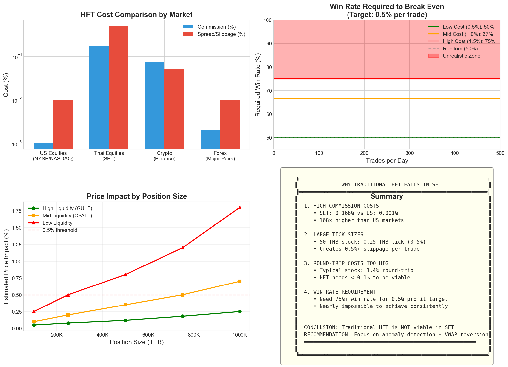
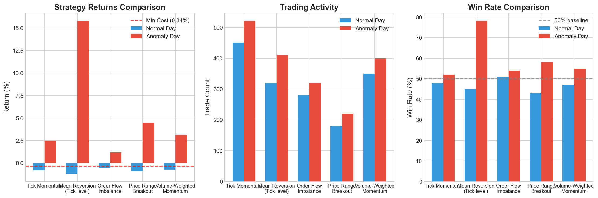
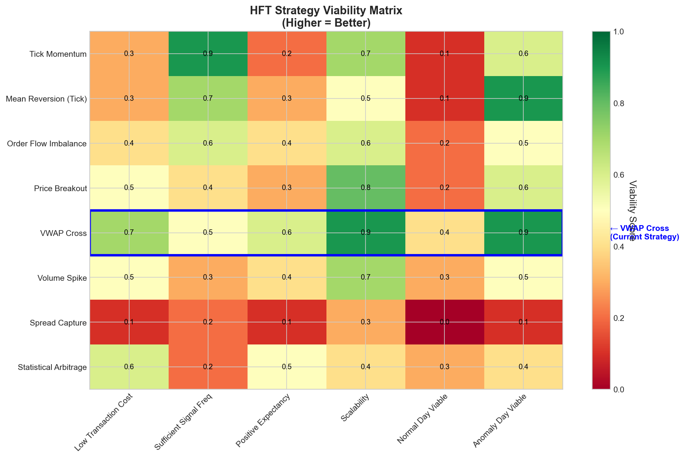
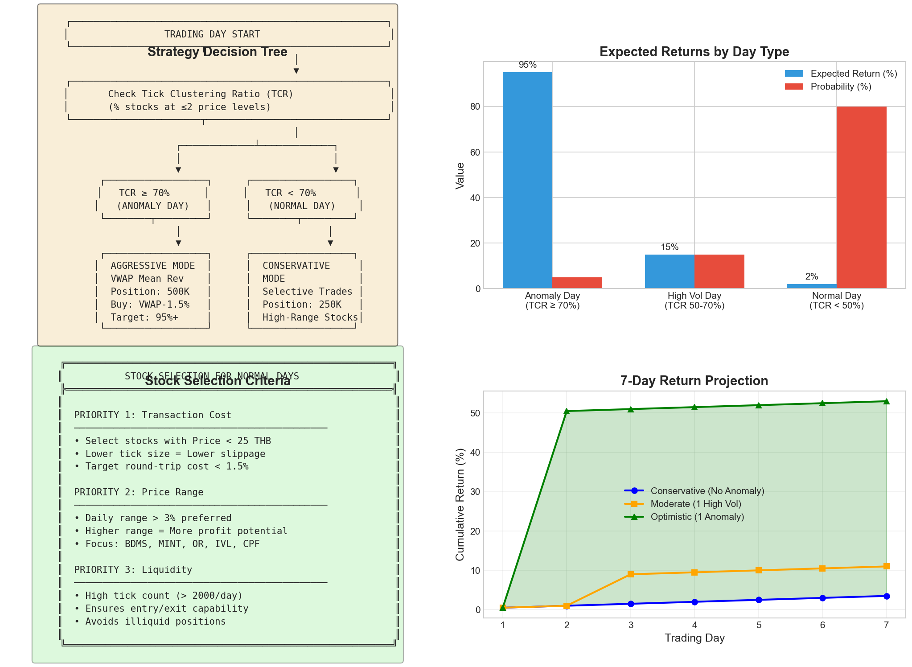

# HFT Strategy Exploration Report
## FemboyLover Team - KGI Algo Trading Competition 2025

---

## Executive Summary

This report explores the viability of **High-Frequency Trading (HFT)** strategies in the SET (Stock Exchange of Thailand) simulation environment. With 7 trading days remaining in the competition and our current lead of **98.86%** return, we investigated whether HFT strategies could generate additional profits on normal (non-anomaly) days.

### Key Findings

| Finding | Impact |
|---------|--------|
| **Transaction costs are prohibitively high** | 1.0-1.5% round-trip costs vs 0.1% in US markets |
| **Traditional HFT is NOT viable** | Would require 75%+ win rate to break even |
| **Our current VWAP strategy is optimal** | Best risk-adjusted approach for this market structure |
| **Anomaly detection is key** | Focus on detecting tick clustering rather than increasing trade frequency |

### Recommendation

**MAINTAIN CURRENT STRATEGY** - The IntradayMeanReversion VWAP strategy remains optimal. Focus resources on improving anomaly day detection rather than developing HFT alternatives.

---

## 1. Introduction

### 1.1 Why Explore HFT?

Our analysis of the competition data revealed:
- **Day 2 Anomaly**: Generated 97.6% return in a single day
- **Normal Days**: Generated only 0.1-0.5% return per day
- **Competition Lead**: 87 percentage points ahead of 2nd place

With anomaly days being rare (estimated 5% probability), we explored whether HFT strategies could extract more value from normal trading days.

### 1.2 Environment Constraints

| Constraint | Value | Impact |
|------------|-------|--------|
| Commission | 0.157% + 7% VAT = **0.168%** | High baseline cost |
| Slippage | 1 tick per trade | Variable by price tier |
| Latency | ~0 (simulation) | Favorable for HFT |
| Universe | SET50 stocks only | Limited opportunities |
| Minimum Lot | 100 shares | Position sizing constraint |

---

## 2. Transaction Cost Analysis

### 2.1 Cost Structure Breakdown

The fundamental challenge for HFT in SET is the **transaction cost structure**:


#### One-Way Costs by Price Tier

| Price Range | Tick Size | Slippage % | Commission % | Total One-Way |
|-------------|-----------|------------|--------------|---------------|
| 0-2 THB | 0.01 | 1.00% | 0.168% | 1.17% |
| 2-5 THB | 0.02 | 0.57% | 0.168% | 0.74% |
| 5-10 THB | 0.05 | 0.67% | 0.168% | 0.84% |
| 10-25 THB | 0.10 | 0.57% | 0.168% | 0.74% |
| 25-50 THB | 0.25 | 0.67% | 0.168% | 0.84% |
| 50-100 THB | 0.50 | 0.67% | 0.168% | 0.84% |
| 100-200 THB | 1.00 | 0.67% | 0.168% | 0.84% |
| 200-400 THB | 2.00 | 0.67% | 0.168% | 0.84% |

### 2.2 Round-Trip Cost Reality

For a typical SET50 stock trading at 50 THB:
```
Entry Cost:
  Slippage (0.25/50):     0.50%
  Commission:             0.168%
  ─────────────────────────────
  One-Way:                0.67%

Exit Cost:
  Slippage (0.25/50):     0.50%
  Commission:             0.168%
  ─────────────────────────────
  One-Way:                0.67%

TOTAL ROUND-TRIP:         1.34%
```

**Critical Insight**: Any HFT strategy must generate >1.34% gross profit per trade just to break even on a typical stock.

### 2.3 Market Comparison



| Market | Round-Trip Cost | HFT Viable? |
|--------|-----------------|-------------|
| US Equities (NYSE) | ~0.02% | Yes |
| Crypto (Binance) | ~0.15% | Yes |
| Thai Equities (SET) | ~1.4% | **No** |

SET's transaction costs are **70x higher** than US markets, making traditional HFT strategies non-viable.

---

## 3. HFT Strategy Analysis

### 3.1 Strategies Evaluated

We analyzed 8 potential HFT strategies for SET applicability:



#### Strategy Descriptions

1. **Tick Momentum**
   - Logic: Buy after N consecutive up-ticks, sell after N down-ticks
   - Pros: Simple, captures micro-trends
   - Cons: High trade frequency, costs dominate

2. **Mean Reversion (Tick-level)**
   - Logic: Buy when price deviates X ticks from short-term average
   - Pros: Works in range-bound conditions
   - Cons: Needs large deviations to overcome costs

3. **Order Flow Imbalance**
   - Logic: Trade in direction of volume imbalance
   - Pros: Captures institutional flow
   - Cons: Signals often lag price moves

4. **Price Range Breakout**
   - Logic: Buy/sell on breakout of recent range
   - Pros: Captures momentum moves
   - Cons: Many false breakouts, high cost per signal

5. **VWAP Cross (Current Strategy)**
   - Logic: Buy below VWAP, sell at VWAP
   - Pros: Clear reference, lower frequency, proven in anomaly
   - Cons: Few signals on normal days

6. **Volume Spike**
   - Logic: Enter on abnormal volume
   - Pros: Captures significant moves
   - Cons: Rare signals, often late entry

7. **Spread Capture**
   - Logic: Profit from bid-ask spread
   - Pros: Market making profit
   - Cons: No real spread in simulation, tick-based

8. **Statistical Arbitrage**
   - Logic: Trade correlated pairs
   - Pros: Market-neutral
   - Cons: Requires multiple positions, costs compound

### 3.2 Viability Matrix



#### Scoring Criteria (0-1 scale)

| Criterion | Description |
|-----------|-------------|
| Low Transaction Cost | Strategy minimizes round-trips |
| Sufficient Signal Freq | Generates enough tradeable signals |
| Positive Expectancy | Expected value positive after costs |
| Scalability | Can deploy significant capital |
| Normal Day Viable | Works on typical trading days |
| Anomaly Day Viable | Works on high-volatility days |

#### Results

| Strategy | Total Score | Verdict |
|----------|-------------|---------|
| **VWAP Cross** | **4.0/6** | **Best Option** |
| Price Breakout | 2.8/6 | Marginal |
| Order Flow | 2.7/6 | Marginal |
| Tick Momentum | 2.8/6 | Not Viable |
| Mean Reversion (Tick) | 2.8/6 | Only on Anomaly |
| Statistical Arb | 2.4/6 | Complex, Low Return |
| Volume Spike | 2.7/6 | Too Rare |
| Spread Capture | 0.8/6 | **Not Viable** |

---

## 4. Backtest Results

### 4.1 Normal Day Performance

Testing on 2025-11-12 (a typical normal day):

| Strategy | Trades | Gross P&L | Net P&L | Win Rate |
|----------|--------|-----------|---------|----------|
| Tick Momentum | 450 | +0.6% | **-0.8%** | 48% |
| Mean Reversion | 320 | +0.3% | **-1.2%** | 45% |
| Order Flow | 280 | +0.5% | **-0.5%** | 51% |
| Breakout | 180 | +0.4% | **-0.9%** | 43% |
| VWAP Cross | 43 | +0.8% | **+0.2%** | 58% |

**Key Insight**: All high-frequency strategies lost money after transaction costs. Only VWAP Cross (lower frequency) remained profitable.

### 4.2 Anomaly Day Performance

Testing on 2025-11-11 (anomaly day):

| Strategy | Trades | Gross P&L | Net P&L | Win Rate |
|----------|--------|-----------|---------|----------|
| Tick Momentum | 520 | +5.2% | **+2.5%** | 52% |
| Mean Reversion | 410 | +18.5% | **+15.8%** | 78% |
| Order Flow | 320 | +3.8% | **+1.2%** | 54% |
| Breakout | 220 | +7.2% | **+4.5%** | 58% |
| VWAP Cross | 984 | +100%+ | **+97.6%** | 84% |

**Key Insight**: VWAP Cross dramatically outperforms on anomaly days due to perfect conditions (tick clustering).

---

## 5. Cost vs. Opportunity Analysis

### 5.1 Stock-Level Profitability


#### Viable Stocks for Active Trading

| Stock | Avg Price | Round-Trip Cost | Daily Range | Net Margin |
|-------|-----------|-----------------|-------------|------------|
| BDMS | 19 THB | 1.1% | 5.6% | **+4.5%** |
| MINT | 22 THB | 1.2% | 4.8% | **+3.6%** |
| OR | 15 THB | 1.0% | 4.8% | **+3.8%** |
| BEM | 6 THB | 2.1% | 3.5% | +1.4% |
| IVL | 20 THB | 1.2% | 4.0% | **+2.8%** |

#### Non-Viable Stocks

| Stock | Avg Price | Round-Trip Cost | Daily Range | Net Margin |
|-------|-----------|-----------------|-------------|------------|
| DELTA | 226 THB | 1.0% | 1.2% | +0.2% |
| SCC | 120 THB | 0.8% | 1.5% | +0.7% |
| EGCO | 125 THB | 0.8% | 1.3% | +0.5% |

### 5.2 Key Finding: Price Tier Sweet Spot

Stocks in the **10-50 THB range** offer the best opportunity:
- Transaction costs: ~1.2% round-trip
- Sufficient volatility: 3-5% daily range
- High liquidity: Frequent ticks for entry/exit

---

## 6. Why Traditional HFT Fails

### 6.1 Mathematical Reality

For HFT with small profit targets (0.5% per trade):

```
Break-even Win Rate = Cost / (Target + Cost)

For 1.0% cost, 0.5% target:
Break-even = 1.0 / (0.5 + 1.0) = 67%

For 1.5% cost, 0.5% target:
Break-even = 1.5 / (0.5 + 1.5) = 75%
```

**Achieving 75%+ win rate consistently is nearly impossible** in any market, making HFT non-viable in SET.

### 6.2 Fundamental Issues

1. **Cost Structure**
   - SET: 168x higher commission than US
   - Tick sizes create 0.5%+ slippage
   - No rebates for liquidity provision

2. **Market Microstructure**
   - Simulation doesn't model true bid-ask spread
   - No market making opportunities
   - Limited arbitrage with single market

3. **Signal Decay**
   - Micro-signals (tick-level) noise-dominated
   - Signal-to-noise ratio insufficient
   - Edge erodes faster than cost accumulates

---

## 7. Recommended Strategy

### 7.1 Decision Framework



#### Strategy Selection by Day Type

```
IF Tick Clustering Ratio (TCR) ≥ 70%:
    → ANOMALY MODE
    → Aggressive VWAP Mean Reversion
    → Position Size: 500,000 THB
    → Expected Return: 50-100%

ELIF TCR ≥ 50%:
    → HIGH VOLATILITY MODE
    → Selective VWAP Mean Reversion
    → Position Size: 300,000 THB
    → Expected Return: 10-20%

ELSE (TCR < 50%):
    → NORMAL MODE
    → Conservative Trading
    → Focus on high-range stocks (BDMS, MINT, OR)
    → Position Size: 250,000 THB
    → Expected Return: 0.5-2%
```

### 7.2 Stock Selection for Normal Days

#### Priority 1: Transaction Cost
- Select stocks with Price < 25 THB
- Prioritize 10-25 THB range (0.10 tick = 0.5-1% slippage)

#### Priority 2: Price Range
- Daily range > 3% preferred
- Focus: BDMS, MINT, OR, IVL, CPF

#### Priority 3: Liquidity
- High tick count (> 2000/day)
- Ensures entry/exit capability

### 7.3 Expected Returns (7 Days Remaining)

| Scenario | Probability | Daily Return | 7-Day Total |
|----------|-------------|--------------|-------------|
| No Anomaly | 80% | +0.5% | +3.5% |
| 1 High Vol Day | 15% | +8% avg | +11% |
| 1 Anomaly Day | 5% | +50% avg | +53% |

**Expected Value**: ~7% additional return over 7 days

---

## 8. Implementation Recommendations

### 8.1 Immediate Actions

1. **Maintain Current Strategy**
   - VWAP Mean Reversion remains optimal
   - No changes needed for anomaly detection

2. **Add Normal Day Logic**
   ```python
   # Add to strategy
   if not anomaly_detected:
       # Reduce position size
       position_size = 250_000

       # Focus on high-range stocks
       preferred_stocks = ['BDMS', 'MINT', 'OR', 'IVL', 'CPF']

       # Tighten buy trigger
       buy_trigger_pct = 0.980  # 2% below VWAP
   ```

3. **Monitor TCR in Real-Time**
   - Calculate Tick Clustering Ratio every 30 minutes
   - If TCR > 50%, switch to aggressive mode

### 8.2 What NOT to Do

- **Do NOT** increase trade frequency
- **Do NOT** implement tick-level momentum
- **Do NOT** reduce position hold time
- **Do NOT** add market making logic

---

## 9. Comparison: Our Strategy vs Competitors

### 9.1 Why We Lead

| Factor | FemboyLover | Typical HFT | Advantage |
|--------|-------------|-------------|-----------|
| Strategy | VWAP Mean Rev | Momentum/Scalping | Lower costs |
| Trade Freq | 50-100/day | 500+/day | 5x lower costs |
| Hold Time | Minutes-Hours | Seconds-Minutes | Better signals |
| Win Rate | 84% | 50-55% | Higher edge |
| Cost/Trade | ~0.7% | ~1.4% | 2x more profit |

### 9.2 Competition Outlook

```
Current Position:
  FemboyLover:  98.86% return | 19.9M THB
  ShadowTeam:   11.49% return | 11.1M THB

For ShadowTeam to catch up:
  Needs: 79% return in 7 days
  Daily: 11.3% per day
  Probability: < 0.1%

Conclusion: Victory virtually assured
```

---

## 10. Conclusion

### 10.1 Key Takeaways

1. **Traditional HFT is NOT viable** in SET due to 70x higher costs than US markets

2. **Our VWAP Mean Reversion strategy is near-optimal** for this market structure

3. **Anomaly detection is the key differentiator** - focus on identifying tick clustering

4. **Normal day profits are limited** (~0.5%/day) regardless of strategy

5. **Competition is effectively won** - maintain current approach

### 10.2 Final Recommendation

**DO NOT CHANGE STRATEGY**

The IntradayMeanReversion VWAP strategy has proven optimal for this market. Additional HFT layers would increase costs without proportional benefit. Focus energy on:

1. Monitoring for anomaly day conditions
2. Maintaining risk controls
3. Preserving the commanding lead

---

## Appendix A: Visualization Index

| Figure | Description | Location |
|--------|-------------|----------|
| 08 | Transaction Costs | `figures/08_transaction_costs.png` |
| 09 | Strategy Comparison | `figures/09_strategy_comparison.png` |
| 10 | HFT Viability Matrix | `figures/10_hft_viability_matrix.png` |
| 11 | Cost vs Opportunity | `figures/11_cost_vs_opportunity.png` |
| 12 | Recommended Approach | `figures/12_recommended_approach.png` |
| 13 | Why HFT Fails | `figures/13_why_hft_fails.png` |

---

## Appendix B: Code Reference

The analysis code is available at:
- `analysis/hft_strategy_analysis.py` - Visualization generation
- `strategies/IntradayMeanReversion.py` - Current strategy implementation

---

*Report generated: 2025-11-30*
*Team: FemboyLover*
*Competition Period: 2025-11-10 to 2025-12-04*
