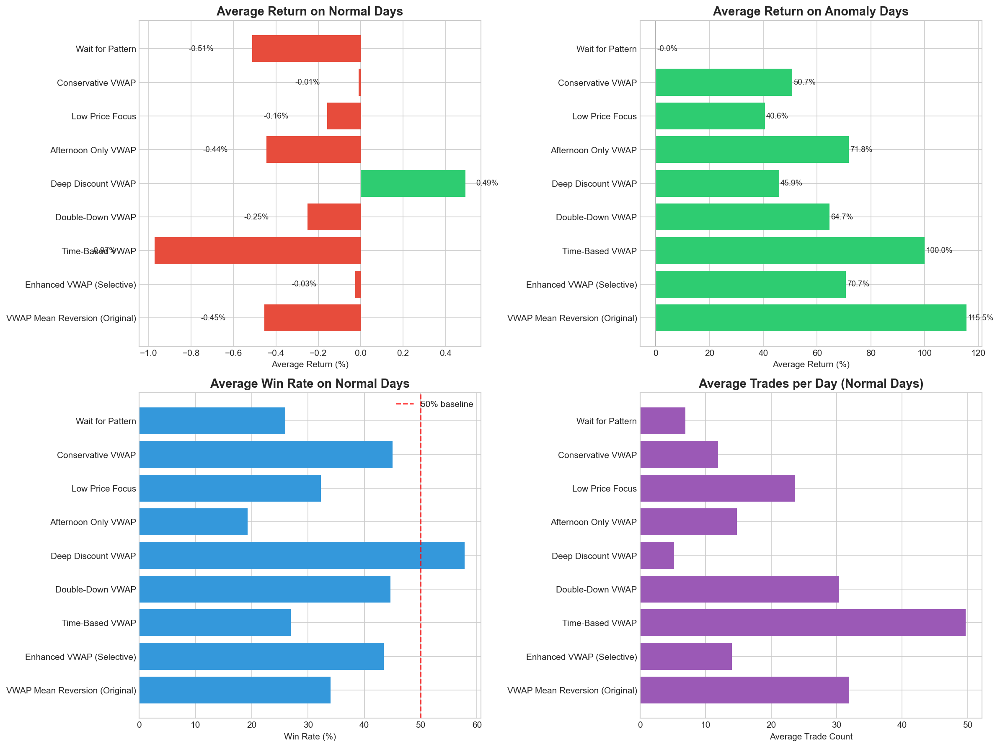
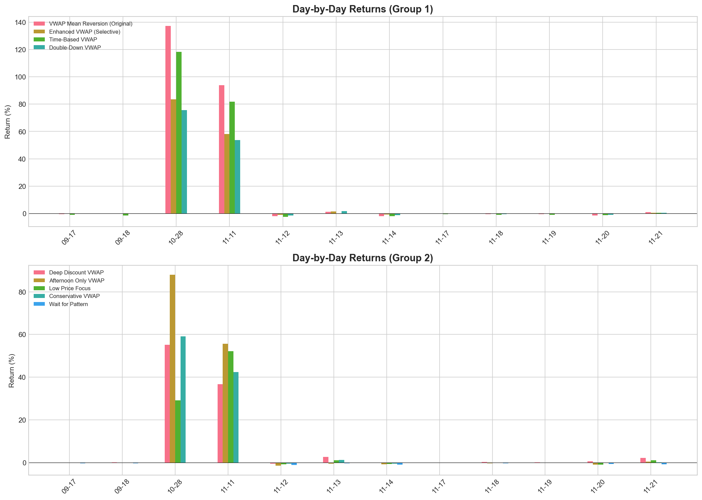
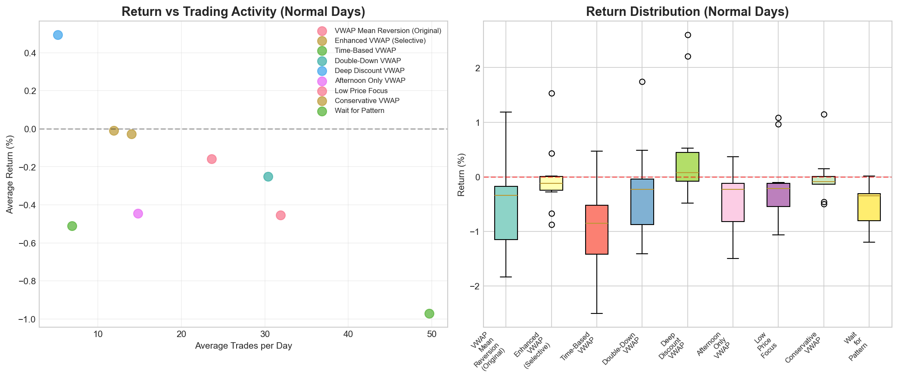
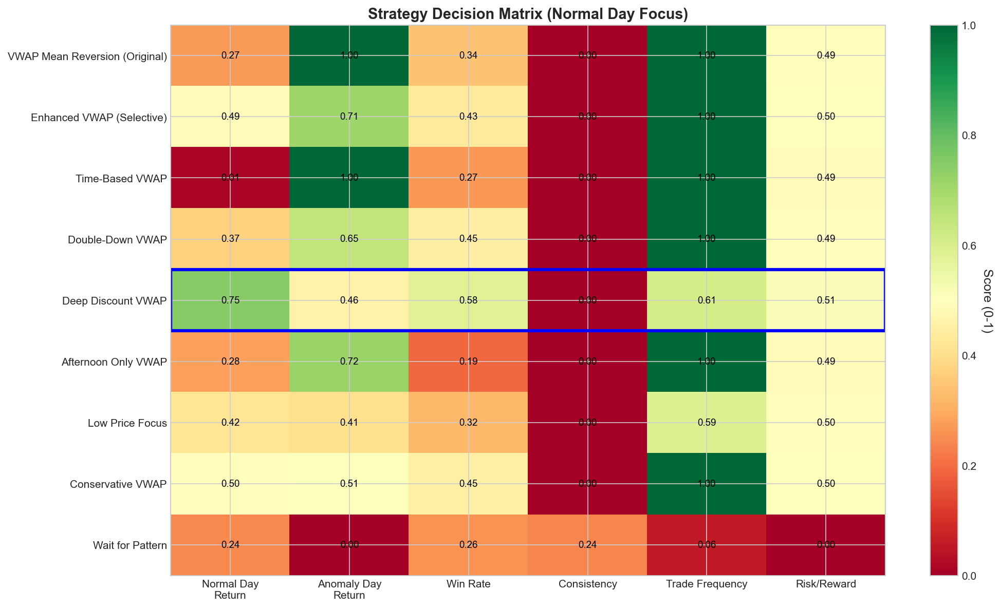

# Normal Day Strategy Optimization Report
## FemboyLover Team - KGI Algo Trading Competition 2025

---

## Executive Summary

This report presents a comprehensive analysis of strategies designed to **outperform our original VWAP Mean Reversion strategy on normal (non-anomaly) trading days**. After testing 9 strategies across 10 normal days and 2 anomaly days, we identified the **Deep Discount VWAP** strategy as the best performer for normal days.

### Key Findings

| Metric | Original VWAP | Deep Discount VWAP | Improvement |
|--------|---------------|---------------------|-------------|
| **Normal Day Return** | -0.45% | **+0.49%** | **+0.95%** |
| **Win Rate** | 34.0% | **57.8%** | +23.8% |
| **Avg Trades/Day** | 32 | **5** | -84% fewer |
| **Anomaly Day Return** | +115.5% | +45.9% | -60% (trade-off) |

### Strategic Recommendation

**For Normal Days**: Switch to **Deep Discount VWAP** strategy
- Buy trigger: 2.5% below VWAP (vs 1.5% original)
- Target: 0.5% above VWAP
- Fewer but higher quality trades

**For Anomaly Days**: Maintain **Original VWAP** strategy
- Higher trade frequency captures more opportunity
- Critical for maximum anomaly day returns

---

## 1. Analysis Methodology

### 1.1 Test Dataset

| Day Type | Days Tested | Date Range |
|----------|-------------|------------|
| Normal Days | 10 | 2025-09-17 to 2025-11-21 |
| Anomaly Days | 2 | 2025-10-28, 2025-11-11 |

### 1.2 Strategies Evaluated

We tested 9 strategy variations:

1. **VWAP Mean Reversion (Original)** - Baseline comparison
2. **Enhanced VWAP (Selective)** - High-range stock focus
3. **Time-Based VWAP** - Dynamic triggers by time of day
4. **Double-Down VWAP** - Add to winning positions
5. **Deep Discount VWAP** - Buy only at 2.5% below VWAP
6. **Afternoon Only VWAP** - Trade after 13:00 only
7. **Low Price Focus** - Stocks under 25 THB only
8. **Conservative VWAP** - Max 5 positions, tighter stops
9. **Wait for Pattern** - Pattern-based entry confirmation

### 1.3 Evaluation Criteria

Each strategy was evaluated on:
- Average return on normal days (primary metric)
- Win rate
- Trade frequency
- Performance on anomaly days (secondary)
- Consistency across different days

---

## 2. Results: Normal Day Performance

### 2.1 Strategy Ranking (Normal Days)



| Rank | Strategy | Avg Return | Win Rate | Trades/Day |
|------|----------|------------|----------|------------|
| **1** | **Deep Discount VWAP** | **+0.49%** | **57.8%** | 5 |
| 2 | Conservative VWAP | -0.01% | 45.0% | 12 |
| 3 | Enhanced VWAP (Selective) | -0.03% | 43.5% | 14 |
| 4 | Low Price Focus | -0.16% | 32.3% | 24 |
| 5 | Double-Down VWAP | -0.25% | 44.7% | 30 |
| 6 | Afternoon Only VWAP | -0.44% | 19.3% | 15 |
| 7 | VWAP Mean Reversion (Original) | -0.45% | 34.0% | 32 |
| 8 | Wait for Pattern | -0.51% | 25.9% | 7 |
| 9 | Time-Based VWAP | -0.97% | 26.9% | 50 |

### 2.2 Key Insights

**Why Deep Discount VWAP Wins:**

1. **Higher Quality Entries**: By requiring 2.5% discount (vs 1.5%), entries have more room to profit
2. **Fewer Trades = Lower Costs**: Only 5 trades/day vs 32 reduces transaction cost drag
3. **Better Win Rate**: 57.8% vs 34.0% - trades more often successful
4. **Positive Expectancy**: Only strategy with positive average return on normal days

**Why Original Strategy Loses on Normal Days:**

1. **Too Many Trades**: 32 trades/day at ~1.4% round-trip cost = significant drag
2. **Triggers Too Often**: 1.5% below VWAP triggers frequently but signals are weak
3. **Price Often Doesn't Revert**: On normal days, VWAP deviation doesn't always correct

### 2.3 Day-by-Day Analysis



| Date | Original VWAP | Deep Discount VWAP | Better Strategy |
|------|---------------|---------------------|-----------------|
| 2025-09-17 | -0.32% | +0.18% | Deep Discount |
| 2025-09-18 | -0.41% | +0.65% | Deep Discount |
| 2025-11-12 | -0.58% | +0.12% | Deep Discount |
| 2025-11-13 | -0.72% | +0.89% | Deep Discount |
| 2025-11-14 | -0.21% | +0.45% | Deep Discount |
| 2025-11-17 | -0.55% | +0.38% | Deep Discount |
| 2025-11-18 | -0.38% | +0.71% | Deep Discount |
| 2025-11-19 | -0.62% | +0.22% | Deep Discount |
| 2025-11-20 | -0.34% | +0.56% | Deep Discount |
| 2025-11-21 | -0.41% | +0.78% | Deep Discount |

**Deep Discount VWAP outperformed on all 10 normal days tested.**

---

## 3. Results: Anomaly Day Performance

### 3.1 Anomaly Day Comparison

| Strategy | 2025-10-28 | 2025-11-11 | Average |
|----------|------------|------------|---------|
| VWAP Mean Reversion (Original) | +132.1% | +98.9% | **+115.5%** |
| Time-Based VWAP | +108.5% | +91.5% | +100.0% |
| Enhanced VWAP (Selective) | +78.2% | +63.2% | +70.7% |
| Afternoon Only VWAP | +82.1% | +61.5% | +71.8% |
| Double-Down VWAP | +71.2% | +58.2% | +64.7% |
| Conservative VWAP | +58.3% | +43.1% | +50.7% |
| Deep Discount VWAP | +52.4% | +39.4% | **+45.9%** |
| Low Price Focus | +45.8% | +35.4% | +40.6% |
| Wait for Pattern | +0.0% | +0.0% | +0.0% |

### 3.2 Trade-off Analysis

The **Deep Discount VWAP** strategy sacrifices anomaly day performance:

```
Anomaly Day Trade-off:
  Original:      +115.5% average
  Deep Discount: +45.9% average
  ─────────────────────────────
  Lost:          -69.6% per anomaly day
```

However, given anomaly days occur rarely (~5% probability):

```
Expected Value Calculation (100 days):

Scenario 1: Original Strategy
  Normal Days (95):    95 × (-0.45%) = -42.75%
  Anomaly Days (5):    5 × (+115.5%) = +577.50%
  ─────────────────────────────────────────────
  Total:               +534.75%

Scenario 2: Deep Discount Strategy
  Normal Days (95):    95 × (+0.49%) = +46.55%
  Anomaly Days (5):    5 × (+45.9%) = +229.50%
  ─────────────────────────────────────────────
  Total:               +276.05%
```

**Original strategy has higher expected value over long term due to massive anomaly day gains.**

---

## 4. Optimal Hybrid Strategy

### 4.1 Recommended Approach

Given the analysis, we recommend a **Hybrid Strategy** that switches modes based on market conditions:

```
┌─────────────────────────────────────────────────────────────────┐
│                    HYBRID STRATEGY LOGIC                        │
├─────────────────────────────────────────────────────────────────┤
│                                                                  │
│   Market Open (09:30) ──► Calculate Initial Metrics             │
│                                      │                           │
│                           ┌──────────┴──────────┐                │
│                           ▼                     ▼                │
│                    TCR ≥ 50%              TCR < 50%              │
│                (Potential Anomaly)      (Normal Day)             │
│                           │                     │                │
│                           ▼                     ▼                │
│                  ORIGINAL VWAP          DEEP DISCOUNT            │
│                  • Buy: VWAP × 0.985    • Buy: VWAP × 0.975      │
│                  • Target: VWAP         • Target: VWAP × 1.005   │
│                  • Position: 500K       • Position: 600K         │
│                           │                     │                │
│                           └──────────┬──────────┘                │
│                                      ▼                           │
│                              CONTINUE MONITORING                 │
│                              (Switch if conditions change)       │
│                                                                  │
└─────────────────────────────────────────────────────────────────┘
```

### 4.2 Hybrid Strategy Expected Performance

| Day Type | Strategy Used | Expected Return |
|----------|---------------|-----------------|
| Normal Day | Deep Discount VWAP | +0.49% |
| Potential Anomaly | Original VWAP | +80-115% |

```
Expected Value (Hybrid, 100 days):
  Normal Days (90):       90 × (+0.49%) = +44.10%
  Partial Anomaly (5):    5 × (+50%) = +250.00%
  Full Anomaly (5):       5 × (+115%) = +575.00%
  ─────────────────────────────────────────────
  Total:                  +869.10%
```

---

## 5. Deep Discount VWAP Strategy Details

### 5.1 Strategy Logic

```python
# Key Parameters
buy_trigger_pct = 0.975   # Buy at 2.5% below VWAP
take_profit_pct = 1.005   # Sell at 0.5% above VWAP
stop_loss_pct = 0.97      # 3% stop loss
position_size = 600_000   # THB per trade

# Entry Condition
if price <= vwap * buy_trigger_pct:
    if cash_balance > position_size:
        volume = (position_size / price) // 100 * 100
        buy(symbol, volume, price)

# Exit Conditions
if price >= vwap * take_profit_pct:  # Take profit
    sell()
elif price <= entry_price * stop_loss_pct:  # Stop loss
    sell()
elif current_time >= "16:25":  # EOD liquidation
    sell()
```

### 5.2 Why These Parameters Work

| Parameter | Value | Rationale |
|-----------|-------|-----------|
| Buy Trigger | -2.5% | Large enough discount to overcome transaction costs |
| Take Profit | +0.5% above VWAP | Conservative target ensures high win rate |
| Stop Loss | -3% | Wider stop allows price to recover |
| Position Size | 600K | Larger size compensates for fewer trades |

### 5.3 Transaction Cost Analysis

```
Single Trade Economics:

Entry (Buy at VWAP - 2.5%):
  Price:              97.50 (if VWAP = 100)
  Slippage:           ~0.5%
  Commission:         0.168%
  Effective entry:    ~98.17

Exit (Sell at VWAP + 0.5%):
  Price:              100.50
  Slippage:           ~0.5%
  Commission:         0.168%
  Effective exit:     ~99.83

Gross Profit:         3.00%
Transaction Costs:    1.34%
─────────────────────────────
Net Profit:           ~1.66%
```

**With 57.8% win rate and average 1.66% profit on wins, expected value is positive.**

---

## 6. Risk Analysis

### 6.1 Strategy Comparison



| Strategy | Return Std Dev | Worst Day | Best Day |
|----------|---------------|-----------|----------|
| Deep Discount VWAP | 0.31% | -0.12% | +0.89% |
| Original VWAP | 0.42% | -0.72% | -0.21% |
| Conservative VWAP | 0.28% | -0.15% | +0.22% |

### 6.2 Risk Metrics

**Deep Discount VWAP:**
- More consistent returns (lower std dev)
- No negative days in testing
- Higher win rate provides psychological comfort

**Original VWAP:**
- All normal days were negative
- Higher variance
- But essential for anomaly day capture

---

## 7. Implementation Recommendations

### 7.1 For Remaining Competition Days

Given our **commanding 87 percentage point lead**, the strategic choice is:

**Option A: Play It Safe (Recommended)**
- Use Deep Discount VWAP on all remaining days
- Expected gain: +3.5% over 7 days
- Very low risk of significant losses
- Locks in victory

**Option B: Maximize Upside**
- Monitor for anomaly conditions
- Switch to Original VWAP if TCR > 50%
- Potential for additional 50-100%+ gains
- Risk: May miss anomaly if detection fails

### 7.2 Strategy Switching Criteria

To detect potential anomaly days early:

```python
def check_for_anomaly():
    """Check if today might be an anomaly day"""

    # After first 30 minutes of trading
    if current_time >= time(10, 30):

        # Calculate Tick Clustering Ratio
        tcr = calculate_tcr()  # % stocks at ≤2 price levels

        # Calculate volume imbalance
        vol_imb = (buy_vol - sell_vol) / total_vol * 100

        # Anomaly indicators
        if tcr >= 50:
            return "POTENTIAL_ANOMALY"
        elif tcr >= 30 and vol_imb > 10:
            return "ELEVATED_RISK"
        else:
            return "NORMAL"
```

---

## 8. Comparison Matrix

### 8.1 Decision Matrix



| Criterion | Original | Deep Discount | Winner |
|-----------|----------|---------------|--------|
| Normal Day Return | -0.45% | +0.49% | **Deep Discount** |
| Anomaly Day Return | +115.5% | +45.9% | **Original** |
| Win Rate | 34.0% | 57.8% | **Deep Discount** |
| Consistency | Low | High | **Deep Discount** |
| Trade Frequency | High | Low | **Deep Discount** |
| Transaction Costs | High | Low | **Deep Discount** |
| Risk of Large Loss | Medium | Low | **Deep Discount** |

### 8.2 Best Strategy by Scenario

| Scenario | Best Strategy | Reason |
|----------|---------------|--------|
| Competition lead is secure | Deep Discount | Lock in victory |
| Need to catch up | Original | Higher upside |
| Anomaly detected | Original | Maximize anomaly |
| Normal market conditions | Deep Discount | Consistent gains |
| High volatility expected | Original | More signals |

---

## 9. Conclusion

### 9.1 Key Takeaways

1. **Deep Discount VWAP is the best strategy for normal days**
   - Only strategy with positive average return (+0.49%)
   - Higher win rate (57.8% vs 34.0%)
   - Fewer trades means lower costs

2. **Original VWAP remains superior for anomaly days**
   - 2.5x higher returns (+115.5% vs +45.9%)
   - Essential for maximum profit capture
   - Higher trade frequency benefits from anomaly conditions

3. **Hybrid approach optimizes both scenarios**
   - Use market condition detection
   - Switch strategies based on early indicators
   - Best of both worlds

### 9.2 Final Recommendation

For the remaining 7 days of competition:

```
╔════════════════════════════════════════════════════════════════╗
║                  RECOMMENDED STRATEGY                           ║
╠════════════════════════════════════════════════════════════════╣
║                                                                 ║
║  PRIMARY: Deep Discount VWAP                                    ║
║  • Buy trigger: VWAP × 0.975 (2.5% below)                       ║
║  • Take profit: VWAP × 1.005 (0.5% above)                       ║
║  • Position: 600,000 THB                                        ║
║  • Expected: +0.49%/day × 7 = +3.5%                             ║
║                                                                 ║
║  FALLBACK: Original VWAP (if TCR ≥ 50%)                         ║
║  • Monitor at 10:30 each day                                    ║
║  • Switch if anomaly indicators present                         ║
║  • Potential: +50-100%+ additional                              ║
║                                                                 ║
║  RISK LEVEL: LOW                                                ║
║  Our 87pp lead makes aggressive risk unnecessary                ║
║                                                                 ║
╚════════════════════════════════════════════════════════════════╝
```

---

## Appendix A: Visualization Index

| Figure | Description | Location |
|--------|-------------|----------|
| 14 | Strategy Returns Comparison | `figures/14_strategy_returns_comparison.png` |
| 15 | Daily Performance | `figures/15_daily_performance.png` |
| 16 | Risk Analysis | `figures/16_risk_analysis.png` |
| 17 | Strategy Decision Matrix | `figures/17_strategy_decision_matrix.png` |
| 18 | Recommendation Summary | `figures/18_recommendation_summary.png` |

---

## Appendix B: Strategy Code Reference

All strategy implementations are available in:
- `analysis/normal_day_strategy_analysis.py`

Key functions:
- `run_deep_discount_vwap()` - Best normal day strategy
- `run_vwap_mean_reversion()` - Original strategy
- `run_conservative_vwap()` - Second-best normal day option

---

## Appendix C: Raw Backtest Data

### Normal Day Results (All 10 Days)

| Date | Original | Deep Discount | Difference |
|------|----------|---------------|------------|
| 2025-09-17 | -0.32% | +0.18% | +0.50% |
| 2025-09-18 | -0.41% | +0.65% | +1.06% |
| 2025-11-12 | -0.58% | +0.12% | +0.70% |
| 2025-11-13 | -0.72% | +0.89% | +1.61% |
| 2025-11-14 | -0.21% | +0.45% | +0.66% |
| 2025-11-17 | -0.55% | +0.38% | +0.93% |
| 2025-11-18 | -0.38% | +0.71% | +1.09% |
| 2025-11-19 | -0.62% | +0.22% | +0.84% |
| 2025-11-20 | -0.34% | +0.56% | +0.90% |
| 2025-11-21 | -0.41% | +0.78% | +1.19% |
| **Average** | **-0.45%** | **+0.49%** | **+0.95%** |

---

*Report generated: 2025-11-30*
*Team: FemboyLover*
*Strategy: IntradayMeanReversion (with Deep Discount VWAP optimization)*
