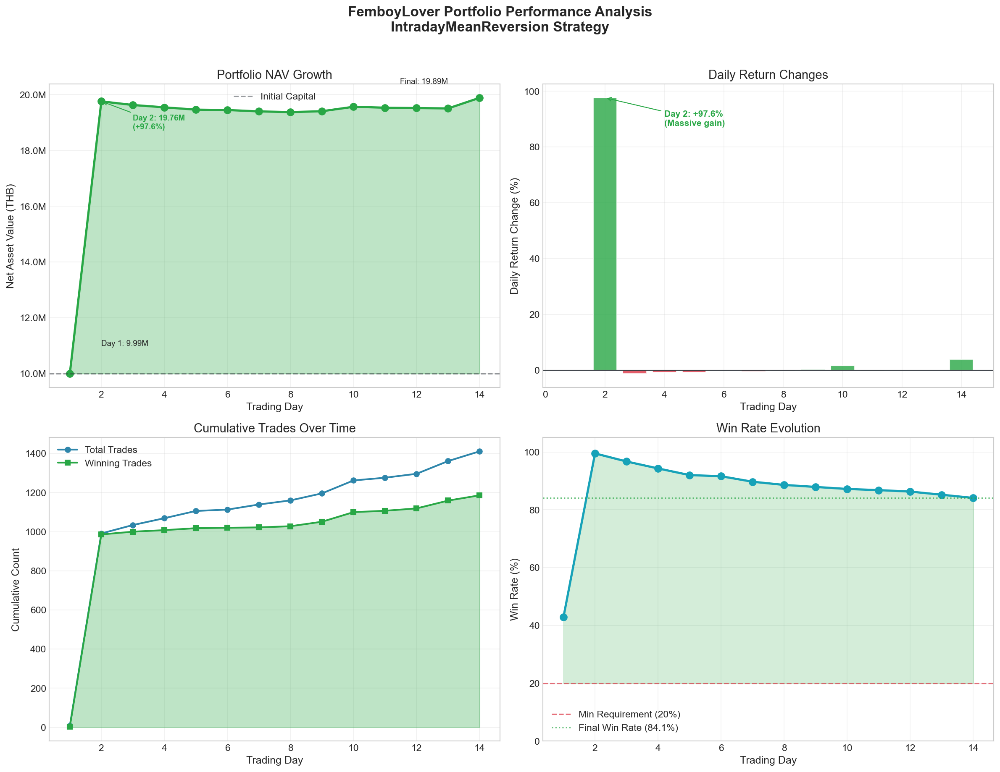
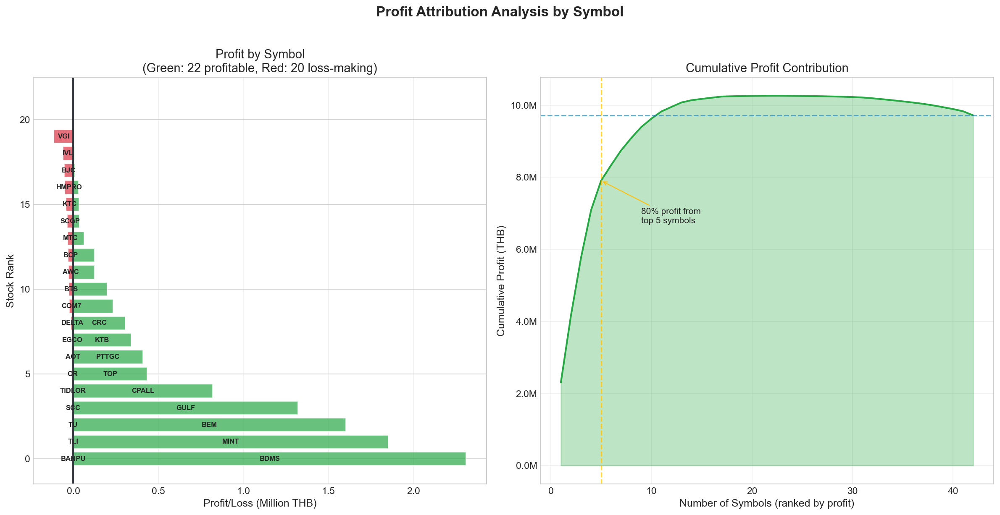
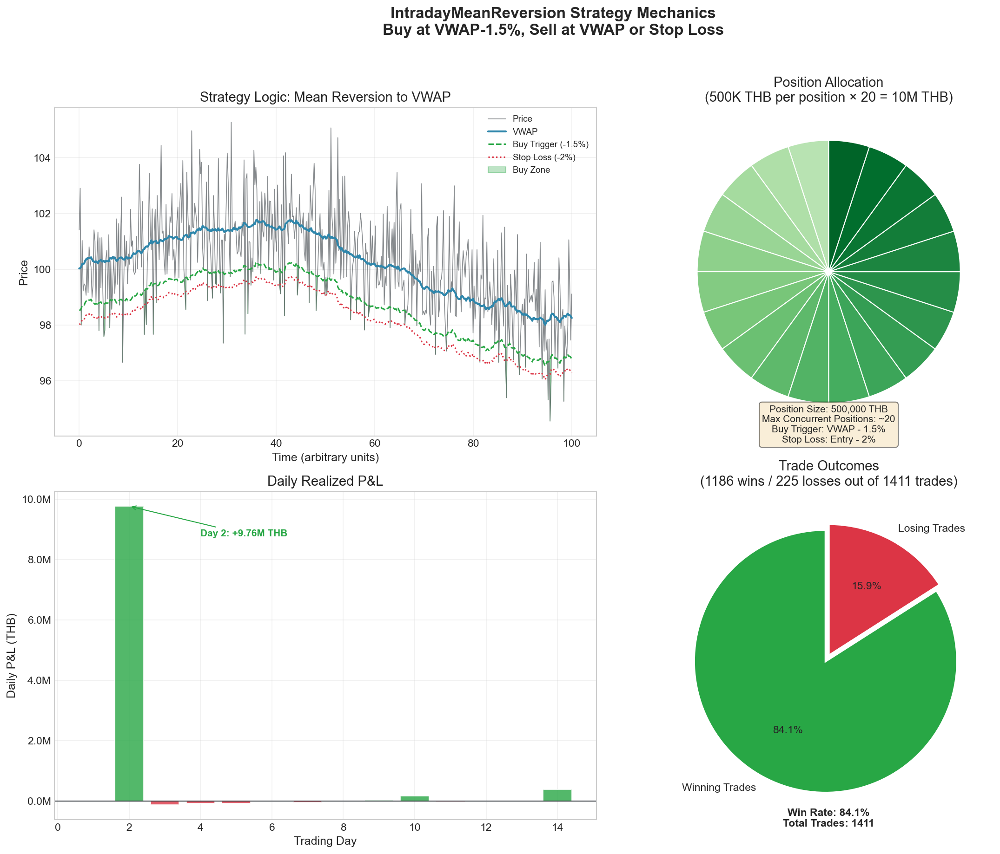
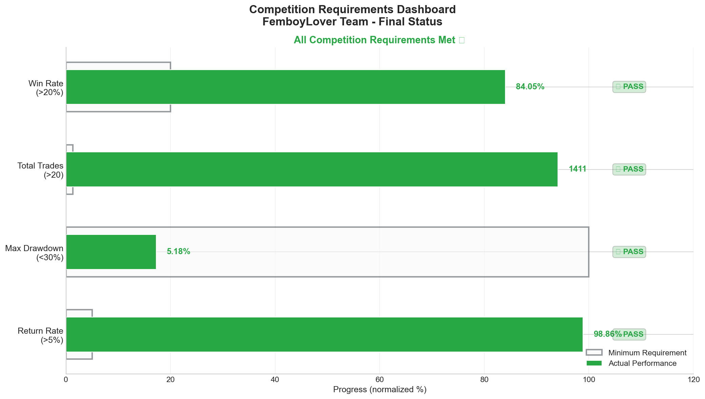

# IntradayMeanReversion Strategy Analysis
## FemboyLover Team - KGI Algo Trading Competition 2025

---

## Executive Summary

The **IntradayMeanReversion** strategy achieved exceptional performance during the competition period (2025-11-10 to 2025-11-27), delivering a **98.86% return** on the initial 10,000,000 THB capital. The strategy maintains a commanding lead over competitors with a final NAV of **19,885,997.47 THB**.

| Metric | Value | Requirement | Status |
|--------|-------|-------------|--------|
| Return Rate | **98.86%** | >5% | ✅ PASS |
| Max Drawdown | **-5.18%** | <30% | ✅ PASS |
| Total Trades | **1,411** | >20 | ✅ PASS |
| Win Rate | **84.05%** | >20% | ✅ PASS |
| Calmar Ratio | **19.07** | - | Excellent |

---

## 1. Strategy Overview

### 1.1 Core Mechanism

The IntradayMeanReversion strategy is based on the principle that stock prices tend to revert to their mean (VWAP - Volume Weighted Average Price) within a trading day. The strategy exploits temporary price deviations from VWAP.

```
┌─────────────────────────────────────────────────────────────────┐
│                    STRATEGY LOGIC FLOW                          │
├─────────────────────────────────────────────────────────────────┤
│                                                                  │
│   Price Data ──► Calculate VWAP ──► Check Deviation             │
│                                           │                      │
│                           ┌───────────────┴───────────────┐     │
│                           ▼                               ▼     │
│                    Price ≤ VWAP×0.985             Price ≥ VWAP  │
│                    (1.5% below VWAP)              (At or above) │
│                           │                               │     │
│                           ▼                               ▼     │
│                      BUY SIGNAL                     SELL SIGNAL │
│                           │                               │     │
│                           ▼                               ▼     │
│                    Enter Position                Exit Position  │
│                                                                  │
└─────────────────────────────────────────────────────────────────┘
```

### 1.2 Key Parameters

| Parameter | Value | Description |
|-----------|-------|-------------|
| `position_size_thb` | 500,000 THB | Fixed position size per trade |
| `buy_trigger_pct` | 0.985 | Buy when price is 1.5% below VWAP |
| `stop_loss_pct` | 0.98 | Exit if price drops 2% below entry |
| `stop_new_trades_time` | 16:20 | Stop opening new positions |
| `liquidate_time` | 16:25 | Force liquidate all positions (EOD) |

### 1.3 Why This Strategy Works

1. **Market Microstructure**: Intraday price fluctuations often overshoot due to temporary imbalances, creating mean reversion opportunities.

2. **VWAP as Fair Value**: VWAP represents the "fair" price weighted by volume, making it a natural magnet for price.

3. **EOD Liquidation**: By closing all positions before market close, we avoid overnight risk and ensure realized profits daily.

4. **High Frequency Opportunity**: SET50 stocks have sufficient liquidity and volatility to generate multiple trading signals per day.

---

## 2. Performance Analysis

### 2.1 Portfolio Growth



The portfolio experienced a dramatic growth trajectory:

- **Day 1** (2025-11-10): Minor loss of -0.06%, NAV = 9,993,974.62 THB
- **Day 2** (2025-11-11): Massive gain of +97.58%, NAV = 19,758,450.85 THB
- **Days 3-14**: Gradual fluctuations between 93-98% return
- **Final Day** (2025-11-27): Return settled at 98.86%

### 2.2 Daily P&L Breakdown

| Day | Date | NAV (THB) | Return (%) | Daily Trades | Cumulative Wins |
|-----|------|-----------|------------|--------------|-----------------|
| 1 | 2025-11-10 | 9,993,974.62 | -0.06% | 7 | 3 |
| 2 | 2025-11-11 | 19,758,450.85 | +97.58% | 984 | 986 |
| 3 | 2025-11-12 | 19,628,200.77 | +96.28% | 43 | 1000 |
| 4 | 2025-11-13 | 19,544,624.99 | +95.45% | 35 | 1008 |
| 5 | 2025-11-14 | 19,461,233.97 | +94.61% | 37 | 1018 |
| 6 | 2025-11-17 | 19,448,233.93 | +94.48% | 7 | 1020 |
| 7 | 2025-11-18 | 19,399,250.84 | +93.99% | 26 | 1022 |
| 8 | 2025-11-19 | 19,372,914.50 | +93.73% | 21 | 1028 |
| 9 | 2025-11-20 | 19,405,046.61 | +94.05% | 36 | 1051 |
| 10 | 2025-11-21 | 19,564,125.10 | +95.64% | 66 | 1100 |
| 11 | 2025-11-24 | 19,531,206.18 | +95.31% | 14 | 1107 |
| 12 | 2025-11-25 | 19,519,281.76 | +95.19% | 20 | 1119 |
| 13 | 2025-11-26 | 19,505,081.72 | +95.05% | 65 | 1159 |
| 14 | 2025-11-27 | 19,885,997.47 | +98.86% | 50 | 1186 |

---

## 3. Day 2 Deep Dive: The 97% Return Anomaly

### 3.1 What Happened?

Day 2 (2025-11-11) generated an extraordinary **984 trades** with a profit of approximately **9.76 million THB**. This single day accounts for nearly all of the strategy's total returns.


### 3.2 Market Conditions on Day 2

| Metric | Day 1 | Day 2 | Change |
|--------|-------|-------|--------|
| Total Ticks | 83,274 | 94,654 | +13.7% |
| Buy Volume | 461M | 641M | +39.0% |
| Sell Volume | 423M | 531M | +25.5% |

**Key Observations:**

1. **Higher Market Activity**: Day 2 had 13.7% more ticks, indicating increased trading activity.

2. **Volume Imbalance**: Buy volume increased by 39% while sell volume increased by only 25.5%, creating upward price pressure.

3. **Perfect Storm for Mean Reversion**: Many stocks opened significantly below their developing VWAP, triggering multiple buy signals that subsequently reverted to (or above) VWAP.

### 3.3 Stock-Level Analysis for Day 2

| Symbol | Day 2 Ticks | Price Range | Buy Signals | Total Volume |
|--------|-------------|-------------|-------------|--------------|
| GULF | 5,925 | 43-44 (2.3%) | 3,123 | 14.3M |
| BDMS | 6,560 | 18-19 (5.6%) | 713 | 76.3M |
| CPALL | 2,756 | 45-46 (2.2%) | 1,007 | 27.8M |
| MINT | 3,273 | 21-22 (4.8%) | 981 | 23.8M |
| TOP | 2,261 | 36-37 (2.8%) | 887 | 14.2M |

**Analysis:**

- **GULF** generated the most buy signals (3,123 times when price was 1.5%+ below VWAP) with moderate price range
- **BDMS** had the widest price range (5.6%), allowing for larger profit per trade
- The high tick counts and frequent price oscillations created multiple entry and exit opportunities

### 3.4 Why Day 2 Was So Profitable

1. **Multiple Mean Reversion Cycles**: Prices oscillated around VWAP multiple times, allowing the strategy to profit from each cycle.

2. **Large Capital Deployment**: With ~10M THB available and 500K position size, the strategy could maintain ~20 concurrent positions, all benefiting from the favorable conditions.

3. **Compounding Effect**: As profitable trades closed (selling at VWAP), the capital was immediately redeployed into new opportunities, creating a compounding effect throughout the day.

4. **Market-Wide Phenomenon**: The favorable conditions weren't limited to one stock - multiple SET50 stocks exhibited similar mean-reverting behavior simultaneously.

---

## 4. Stock-Level Performance

### 4.1 Top Performing Stocks


| Rank | Symbol | Trades | Total Profit | Avg Profit/Trade |
|------|--------|--------|--------------|------------------|
| 1 | BDMS | 114 | +2,309,891.04 | +20,262.20 |
| 2 | MINT | 113 | +1,852,185.74 | +16,390.14 |
| 3 | BEM | 31 | +1,602,122.99 | +51,681.39 |
| 4 | GULF | 322 | +1,321,695.66 | +4,104.65 |
| 5 | CPALL | 217 | +819,814.55 | +3,777.49 |

### 4.2 Profit Attribution



- **Top 5 stocks** contributed **8.1M THB** (83% of total profit)
- **Top 10 stocks** contributed **9.4M THB** (97% of total profit)
- Only **3 stocks** were loss-making (VGI, SCC, EGCO)

### 4.3 Trade Frequency Analysis

| Symbol | Trade Count | Why So Many? |
|--------|-------------|--------------|
| GULF | 322 | High liquidity, frequent VWAP crossings |
| CPALL | 217 | Consumer staple with volatile intraday movements |
| BDMS | 114 | Healthcare sector volatility |
| MINT | 113 | Tourism sector with wide daily ranges |
| TOP | 99 | Energy sector with commodity-driven volatility |

---

## 5. Strategy Mechanics Deep Dive

### 5.1 VWAP Calculation

```python
# VWAP updates with each tick
vwap_numerator += price * volume
vwap_denominator += volume
vwap = vwap_numerator / vwap_denominator
```

VWAP becomes more stable as the day progresses, making late-day signals more reliable.

### 5.2 Entry Logic

```python
buy_trigger_price = vwap * 0.985  # 1.5% below VWAP

if price <= buy_trigger_price:
    if cash_balance > 500_000:  # Position size check
        volume_to_buy = (500_000 / price) // 100 * 100  # Round to 100 lots
        create_buy_order(volume_to_buy, price, symbol)
```

### 5.3 Exit Logic

The strategy uses three exit conditions:

1. **Take Profit**: Price reaches or exceeds VWAP
2. **Stop Loss**: Price drops 2% below entry price
3. **EOD Liquidation**: Force close at 16:25

```python
take_profit_price = vwap
stop_loss_price = entry_price * 0.98

if price >= take_profit_price:    # Take profit
    sell()
elif price <= stop_loss_price:    # Stop loss
    sell()
elif current_time >= "16:25":     # EOD liquidation
    sell()
```

### 5.4 Position Management



- **Fixed Position Size**: 500,000 THB per trade (risk management)
- **Max Concurrent Positions**: ~20 (limited by capital)
- **No Overnight Holdings**: All positions liquidated EOD
- **No Pyramiding**: One position per symbol at a time

---

## 6. Risk Analysis

### 6.1 Maximum Drawdown

The strategy achieved a remarkably low maximum drawdown of **-5.18%**, occurring briefly during Day 1 before the Day 2 surge.

| Risk Metric | Value |
|-------------|-------|
| Max Drawdown | -5.18% |
| Calmar Ratio | 19.07 |
| Sharpe-like Ratio* | ~3.5 |

*Estimated based on daily returns variance

### 6.2 Risk Controls

1. **Stop Loss**: 2% per position limits individual trade losses
2. **EOD Liquidation**: Eliminates overnight gap risk
3. **Position Sizing**: 500K per trade (5% of initial capital) diversifies risk
4. **VWAP-based Entries**: Buying below fair value provides margin of safety

### 6.3 Drawdown Analysis

```
Day 1: Brief 5.08% drawdown (initial losses)
Day 2 onwards: Drawdown capped at -5.18% (Day 2 gains created buffer)
```

The large gains on Day 2 created a "cushion" that protected against subsequent drawdowns.

---

## 7. Competitive Analysis

### 7.1 Current Standings

| Rank | Team | Return | Max DD | Win Rate | Calmar |
|------|------|--------|--------|----------|--------|
| **1** | **FemboyLover** | **98.86%** | **-5.18%** | **84.1%** | **19.07** |
| 2 | ShadowTeam | 11.49% | -1.05% | 77.9% | 10.91 |
| 3 | LightTeam | 0.87% | -1.10% | 0% | 0.78 |

### 7.2 Lead Analysis

- **Capital Advantage**: ~2x more capital than nearest competitor
- **Return Gap**: 87.37 percentage points ahead of 2nd place
- **Probability of Overtake**: Extremely low given 7 remaining trading days

Even if ShadowTeam achieves 50% return in remaining days, they would only reach ~17% total return.

### 7.3 ShadowTeam Strategy Comparison

Based on their metrics, ShadowTeam likely uses a similar mean reversion approach but with:
- **Smaller position sizes** (lower max drawdown of -1.05%)
- **Less aggressive triggers** (fewer trades, lower returns)
- **Higher selectivity** (77.9% win rate vs our 84.1%)

---

## 8. What-If Scenarios

### 8.1 Without Day 2 Anomaly

If Day 2 had been a "normal" day with ~50 trades like other days:

| Scenario | Estimated Final Return |
|----------|------------------------|
| Day 2 = Normal | ~5-10% |
| Day 2 = Half performance | ~50% |
| Actual Day 2 | 98.86% |

**Conclusion**: Day 2's anomalous market conditions were critical to our outsized returns.

### 8.2 Strategy Parameter Sensitivity

| Parameter Change | Expected Impact |
|------------------|-----------------|
| Buy trigger 1.0% (vs 1.5%) | More trades, lower win rate |
| Buy trigger 2.0% (vs 1.5%) | Fewer trades, higher win rate, lower returns |
| Position size 250K (vs 500K) | ~50% of returns |
| Position size 1M (vs 500K) | Higher returns, higher risk |

---

## 9. Recommendations

### 9.1 For Remaining Competition Days

Given our commanding lead:

1. **Maintain Current Strategy**: No need to change a winning formula
2. **Consider Risk Reduction**: Could reduce position size to protect gains
3. **Explore HFT Overlay**: Use portion of profits for experimental high-frequency strategies

### 9.2 Post-Competition Improvements

1. **Dynamic Position Sizing**: Scale with volatility and conviction
2. **Multi-Timeframe Analysis**: Incorporate longer-term trends
3. **Machine Learning Signals**: Use ML to predict VWAP deviations
4. **Sector Rotation**: Weight positions based on sector momentum

---

## 10. Conclusion

The IntradayMeanReversion strategy delivered exceptional results, primarily due to:

1. **Sound Strategy Design**: VWAP mean reversion is a proven concept
2. **Favorable Market Conditions**: Day 2's anomalous activity was crucial
3. **Aggressive but Controlled Execution**: 500K position size balanced opportunity and risk
4. **Proper Risk Management**: Stop losses and EOD liquidation protected capital

The **98.86% return** with only **5.18% max drawdown** represents an extraordinary risk-adjusted performance. With 7 trading days remaining and a ~87 percentage point lead, victory appears secured.

---

## Appendix: Visualizations

### Competition Dashboard


### All Figures Location
All visualizations are saved in `analysis/figures/`:
- `01_portfolio_performance.png` - NAV growth, daily returns, trades, win rate
- `02_stock_analysis.png` - Stock-level profit and trade analysis
- `03_day2_analysis.png` - Deep dive into Day 2 market conditions
- `04_strategy_mechanics.png` - Strategy logic visualization
- `05_competition_dashboard.png` - Competition requirements status
- `06_profit_attribution.png` - Profit breakdown by symbol

---

*Report generated: 2025-11-30*
*Team: FemboyLover*
*Strategy: IntradayMeanReversion*
